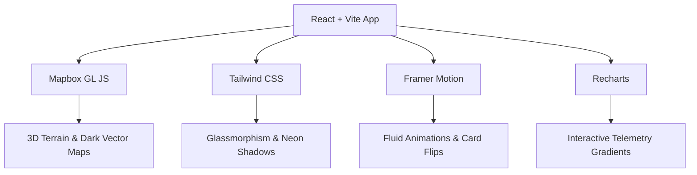

# Tech Stack Options & Expert Recommendation
## Connemara Oyster Restoration Portal

To build a highly interactive, modern web portal with a significant visual **"wow" factor**, we must evaluate framework simplicity, animation capabilities, mapping capabilities, and ease of deployment.

---

## 1. The Technology Options

We have three primary architectural routes:

### Option A: React + Vite (The Recommended Pick)
*   **Aesthetics & UX:** Excellent. React's state management makes complex interactive elements (glowing SVG anatomy, drag-and-drop microscope game, telemetry sliders) smooth and easy to build.
*   **Performance:** Extremely fast developer hot-reloads and optimized static compilation.
*   **Hosting:** Compiles to static assets that deploy seamlessly and for free to **GitHub Pages**.

### Option B: Next.js (Overkill)
*   **Aesthetics & UX:** Excellent, but overkill for this scope.
*   **Hosting:** Intended for Node.js servers (e.g., Vercel). Deploying to GitHub Pages requires static exports, which breaks key features.
*   **Pain Point:** SSR (Server-Side Rendering) commonly clashes with client-only GIS map libraries (like Leaflet/Mapbox), requiring dynamic imports and extra boilerplate code.

### Option C: Vanilla HTML / CSS / JS (Barebones)
*   **Aesthetics & UX:** Harder to scale. Building multi-stage mini-games and complex dashboard states in raw JS will result in monolithic, hard-to-maintain scripts.
*   **Hosting:** Instant and simple on GitHub Pages.

---

## 2. My Recommended Pick & Why

To achieve maximum visual premium quality, my recommendation is to use **React + Vite** with the following specific choices:



### Why this specific stack?

#### 1. Mapbox GL JS (Over Leaflet.js)
While Leaflet is simple and free, it looks like a flat paper map. **Mapbox GL JS** provides:
*   **3D Camera Control:** The developer can tilt and rotate the view, showing the Connemara coastline in perspective.
*   **3D Terrain:** It renders height elevations, which is incredible for visualizing bays and sea level variations.
*   **Visual Integration:** You can design a dark, glowing cyan-and-navy map layer that matches your website's ocean aesthetic perfectly.

#### 2. Framer Motion (Over Raw CSS Animations)
Framer Motion is a React-native animation library. It enables:
*   **Micro-interactions:** Interactive components (like hovering over the anatomical viewer or dragging sediment samples) react instantly with smooth spring physics.
*   **Layout Animations:** When filtering points on the sidebar, the list elements slide and rearrange themselves smoothly rather than snapping abruptly.

#### 3. Tailwind CSS (For Modern Styling Utilities)
Tailwind makes it incredibly easy to configure modern UI trends:
*   **Glassmorphism:** Easily create frosted-glass panels using backdrop blur filters (`bg-slate-900/50 backdrop-blur-md border border-white/10`).
*   **Glow & Shadows:** Apply custom neon box-shadows to signify active or correct choices.

#### 4. Recharts (For Glowing Telemetry Charts)
Unlike old canvas-based chart libraries, Recharts is SVG-based and integrates directly with React. It allows us to:
*   Use gradient fills beneath telemetry lines (e.g., a glowing teal fading to transparent).
*   Add custom interactive tooltip cursors that pulse when hovered.

---

## 3. Recommended Packages to Install

If you initialize a React + Vite project, run this command in your terminal to install the recommended dependencies:

```bash
npm install mapbox-gl recharts framer-motion lucide-react
```
*(Note: If using Mapbox, the developer will need to register for a free Mapbox account to get an Access Token).*
